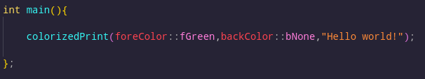

# Colorized Print

## What is
This is an simple C/C++ header-only library to make pretty prints with some color. Useful to make a terminal program more attractive for you or your users.

## Header-Only
Yes, you only need to wget it and import in your cpp file, and then it will work, very simple

## Available colors
The library support some different colors, and exists two types, foreground and background

Colors:

    Black, Red, Green, Yellow, Blue, Magenta, Cyan, Gray, Bright red, bright green, Bright yellow, Bright blue, Bright magenta, Bright cyan and Bright white

All colors can be foreground and background, but in the code has a little difference

## colorizedPrint method
The colorizedPrint method require three arguments: foreground, background and text, for each argument exist an enum for it

## How to use
It's is really simple, like the image below

and the result as expected

